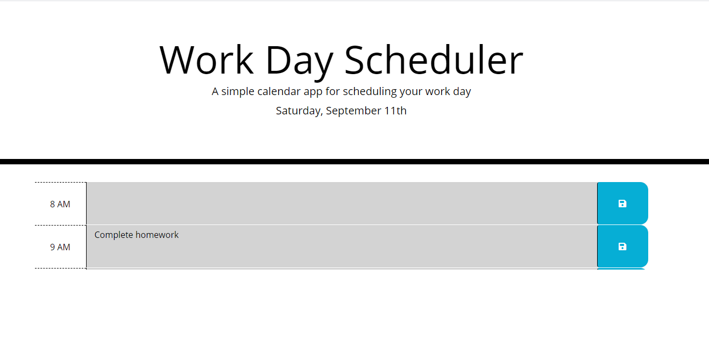
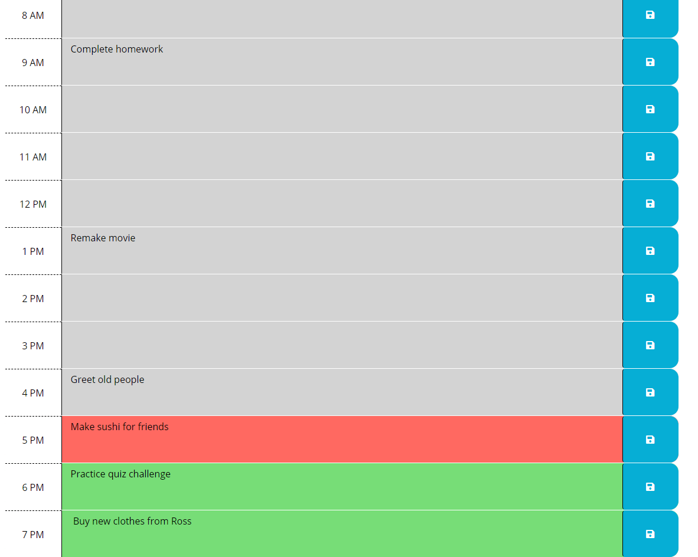

# calender-app

Javascript Challenge

**Version 1.4.0**

**Calender App challenge activity.**

The aim of this project is to create a simple calendar application that allows a user to save events for each hour of the day.

This project focuses on the use of javascript to create this application.

Other than creating a user friendly app, this project required the use of certain technologies. Using these technologies also ensured that the user has an enjoyable experience, as well as showcases my skills and knowledge gained through this program.

## About the Project 

As I proceed in my career as a web developer, I will probably be asked to complete a coding assessment. These assessments are typically a combination of challenging and interactive challenges. As a bootcamp student, I want to build a calender app that users can use to create events and ultimately save those event, retrieve them later, and possibly edit previous stored events

Initial design of the app has the following deliverables:

When the user opens the app, the current day is displayed at the top of the calender.

They are able to scroll and add events to any blocks at any given hour.

The calender shows a color coded time block to indicate the time frame of each events.

Most importantly, users may be able to save their events which will be stored to local storage and easily retrieved.

## Minimun Requirements

Functional, deployed application.

GitHub repository with README describing project.

Images showing completed portions of the app.

After the game ends, the user can save their initials and score to a highscores view using local storage.

## Built With

- HTML
- CSS
- Javascript
- Bootstraps
- JQuery

## Work Completed

**A successful completion of this project includes the following:**

- [x]Pseudo coding
- [x]Use of loops and if, else, esleif, and while statements.
- [x]Application of arrays
- [x]Use of DOM and other methods
- [x]Creating multiple variables and functions
- [x]Applying queryselectors to retrieve information
- [x]Applying bootstraps and jQuery
- [x]Applying local storage to retrieve information

## Project Visual

- [x]Showing the current date at the top of the calender app.

- [x]Showing color coded time blocks that represent past, present and future events.
    - The grey colored time block indicates past events relative to current hour 
    - The red colored time block indicates current events at the current hour 
    - The green colored time block indicates future events relative to current hour

## Github pages and links

This project has been deployed to GitHub Pages. 
- [Deployed application](https://kenesei91.github.io/calender-app/){:target="_blank" "rel="moopener"}

- [Github Repository](https://github.com/kenesei91/calender-app){:target="_blank" "rel="moopener"}

## Contributors

- Kenechukwu K Ilochonwu <keneilo91@yahoo.com>

## Licence & Copyright

© Kenechukwu K Ilochonwu, Web Project Design

Licensed under the [LICENSE] (MIT LICENSE)